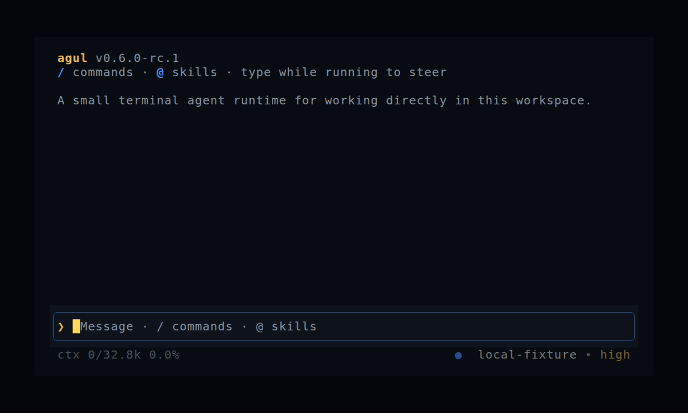

# Agul

[](https://github.com/storious/agul/actions/workflows/ci.yml)
[](LICENSE)

Agul is a terminal coding agent written in Rust. Run it inside a project, talk
to a model, and let it read, edit, execute, and verify work without leaving the
terminal.



## What works

- Full-screen TUI with visible reasoning, tool activity, steering, `/stop`,
  session history, and an editable multiline input.
- Four built-in tools: `read`, `write`, `edit`, and `shell`.
- DeepSeek, GLM Coding Plan, ChatGPT/Codex account login, and local
  OpenAI-compatible endpoints.
- Persistent sessions, `--continue`/`--resume`, per-response token usage, KV
  reporting, and a versioned Usage Ledger.
- Project and user Skills, prepared Plugins, and ARI for optional coordination.

Web Search and multi-agent coordination are optional AgentKube extensions; they
are not hidden built-ins in the minimal runtime.

## Install the first experience release

Agul itself does **not** require Bun, Node.js, or Agulater. `0.6.0-rc.1` is a
prerelease, so its installer URL is deliberately pinned instead of using the
stable-only GitHub `latest` alias:

Linux or macOS:

```console
curl -fsSL https://github.com/storious/agul/releases/download/v0.6.0-rc.1/install.sh | sh
```

Windows PowerShell:

```powershell
irm https://github.com/storious/agul/releases/download/v0.6.0-rc.1/install.ps1 | iex
```

The same release page contains archives for Windows x64, Linux x64, macOS x64,
and macOS ARM64.

[Agulater](https://github.com/storious/agulater) is optional. Use it when
you want managed runtime updates, Catalog packages, Skills, or Plugins. Its
published installer contains a standalone executable, so normal users do not
need Bun, Node.js, or npm. Bun is only a build and source-development tool for
Agulater.

## Build the current source

Contributors can build the same runtime directly:

```console
git clone https://github.com/storious/agul.git
cd agul
cargo build --release --locked
```

Run `target/release/agul` on Linux or macOS, or
`target\release\agul.exe` on Windows.

## Run

Agul defaults to DeepSeek. Set the key, enter a project, and run `agul`; the
workspace defaults to the current directory.

```console
export DEEPSEEK_API_KEY='<key>'
cd my-project
agul
```

PowerShell uses `$env:DEEPSEEK_API_KEY = '<key>'` and the same `agul` command.

Other connections are explicit:

| Connection | Command |
| --- | --- |
| GLM Coding Plan | `agul chat --provider glm --reasoning-effort high` |
| ChatGPT/Codex quota | `agul account login`, then `agul chat --engine codex` |
| Local/OpenAI-compatible | `agul chat --base-url <url>/v1 --model <model>` |

For one non-interactive turn:

```console
agul chat --prompt "find the failing test, fix it, and rerun it" --json
```

Useful interactive commands are `/status`, `/skills`, `/usage`, `/compact`,
`/sessions`, `/stop`, and `/exit`. Resume the latest workspace session with
`agul chat --continue` or choose one with `agul chat --resume`.

## Extensions

- Agulater installs and prepares optional `.agents` packages.
- AgentKube supplies optional Skills, Plugins, specialist agents, Web Search,
  and multi-agent coordination.
- ARI lets those components drive the same Agul runtime instead of introducing
  another agent CLI.

Basic Agul use needs none of them.

## Documentation

- [Chat and tools](docs/chat.md)
- [ChatGPT account mode](docs/codex-account.md)
- [Sessions and usage](docs/sessions-and-usage.md)
- [Skills and launches](docs/skills.md)
- [Plugins](docs/plugins.md)
- [ARI](docs/ari/README.md)
- [Contributing](CONTRIBUTING.md)

Apache-2.0. See [LICENSE](LICENSE). Runtime dependency licenses are summarized
in [THIRD_PARTY_NOTICES.md](THIRD_PARTY_NOTICES.md).
